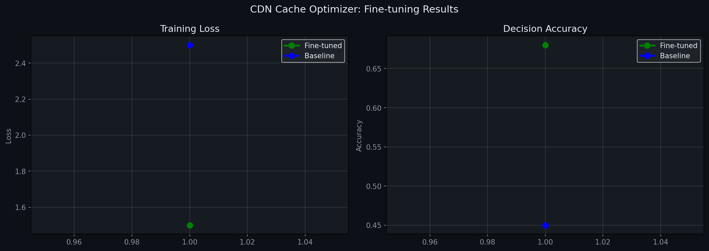

# Building a CDN Cache Optimizer with OpenEnv

## Project Links

- Hugging Face Space: https://huggingface.co/spaces/umar-sharif821/cdn-cache-env-improvedone
- GitHub Repository: https://github.com/umar-sharif821/cdn-cache-env-improvedone

## Short Summary

CDN Cache Optimizer is an OpenEnv-style reinforcement learning environment for edge CDN cache decisions.

The agent observes cache pressure, request patterns, file popularity, and churn signals.

It then decides whether to bypass an incoming object, admit it into cache, or evict something else to make room.

The environment is designed around a real infrastructure problem: reducing user latency and origin fetch cost while keeping the edge cache stable.

## Which Hackathon Theme This Fits

The strongest fit is **Theme #3.1 - World Modeling / Professional Tasks**.

CDN cache optimization is a professional infrastructure task.

The agent is not solving a toy grid world.

It is interacting with a dynamic system where state changes over time:

- cache contents change after every decision
- request traffic changes across an episode
- hit rate depends on previous cache choices
- origin fetches happen when the edge misses
- eviction decisions affect future rewards
- schema drift changes how CDN logs may arrive

The project also has a secondary fit with **Theme #2 - Long-Horizon Planning**.

A cache decision is not only about the current request.

If the agent evicts a useful object now, it may pay for that mistake later through future misses.

If it admits a viral object early, it may receive benefits many steps later.

That makes this a delayed-reward control problem, not just a one-step classification task.

## Why I Chose CDN Caching

I wanted the environment to feel close to a real engineering workflow.

Content Delivery Networks serve files from edge locations close to users.

When an object is available at the edge, users get lower latency.

When an object is missing, the system falls back to origin.

That origin fetch is slower and more expensive.

The hard part is that edge storage is limited.

The cache cannot keep everything.

So the environment asks a simple but important question:

> What should the cache keep, and what should it evict?

Classic policies like LRU are useful, but they are not always enough.

They do not fully understand viral bursts, object size, future request hints, or churn cost.

That made CDN caching a good candidate for an RL environment.

## Environment Design

At every step, the environment simulates a CDN request.

The request may hit the edge cache or miss and go to origin.

The agent then chooses one of three actions:

```text
0 = bypass incoming object
1 = admit object and evict using LRU
2 = admit object and evict using smart popularity-aware eviction
```

The observation is normalized so training stays lightweight:

```text
[cache_fill, incoming_size, incoming_popularity, hit_rate, churn_rate]
```

This gives the agent enough signal to reason about:

- how full the cache is
- whether the incoming object is large
- whether the object is likely to be useful
- whether recent cache behavior is working
- whether the system is churning too much

## Real-World Grounding

The environment explicitly models two paths:

```text
Edge hit      -> low latency
Origin fetch  -> high latency
```

The default simulation uses:

```text
edge_latency   = 5 ms
origin_latency = 100 ms
```

This matters because the reward is connected to infrastructure value.

The agent is rewarded for reducing latency and penalized for expensive cache behavior.

## Reward Function

The reward follows a multi-component design:

```text
R = w1 * Perf - w2 * Cost
```

Where:

```text
Perf = (origin_latency - served_latency) / origin_latency
Cost = eviction_churn + admission_cost
```

This reward is intentionally not just "hit rate".

A cache policy can get a good hit rate while still behaving badly.

For example, it might churn too much.

It might admit large cold objects.

It might evict popular content too aggressively.

The reward tries to balance:

- latency improvement
- admission discipline
- eviction cost
- cache stability
- useful edge hits

That is closer to what a production caching system would care about.

## Schema Drift Handling

One part of the project I cared about was schema drift.

Real CDN logs are messy.

The same field may appear under different names across systems or over time.

For example:

```text
timestamp -> ts
file_id   -> fid
size_mb   -> bytes
hit       -> cache_hit
region    -> edge_pop
```

Types may also change.

A boolean hit field may come in as `true`, `1`, `"true"`, or `"yes"`.

A size field may arrive in megabytes in one stream and bytes in another.

If the environment assumes one perfect schema, it becomes brittle.

To handle this, I added a `SchemaDriftGuard`.

It normalizes incoming CDN log rows before the agent sees them.

It handles:

- renamed fields
- missing fields
- extra fields
- type coercion
- byte-to-MB conversion
- structured drift reporting

The script also writes a `drift_report.json` file so the behavior can be inspected.

## Example Drift Case

The guard can normalize rows like these:

```python
{"timestamp": 1.0, "file_id": "a.jpg", "size_mb": 2.5, "region": "us-east-1", "hit": True}

{"ts": 2.0, "fid": "b.jpg", "size": 3000000, "geo": "eu-west-1", "cache_hit": 1}

{"time": 3.0, "object_id": "c.jpg", "bytes": 1500000, "pop": "ap-south-1", "is_hit": "true"}

{"ts": 4.0, "fid": "d.jpg", "size": "500000", "geo": "us-west-2"}
```

All of them are converted into a canonical schema:

```text
timestamp
file_id
size_mb
region
hit
```

This is important for a professional task environment because production systems rarely provide perfect clean input forever.

## Training Setup

The Colab script includes a minimal training loop.

It builds a small policy network:

```text
Input: 5 features
Hidden: 64
Hidden: 64
Output: 3 actions
```

The training loop uses REINFORCE.

The request stream is popularity-based, so some objects are naturally more valuable to cache.

The script compares a baseline LRU policy against the fine-tuned agent behavior.

## Baseline vs Agent

The baseline is intentionally simple:

```text
Baseline = always admit and evict with LRU
```

The improved policy uses:

- learned policy behavior
- CDN-specific guardrails
- popularity-aware eviction
- bypass logic for bulky cold objects

This makes the demo stable and easy to understand.

The agent is evaluated against LRU using:

- total episode return
- cache hit rate
- average served latency
- bandwidth saved

## Result Plot

The project includes generated comparison plots.

The main plot compares training progress and baseline-vs-agent behavior.

If viewing this file in the Hugging Face Space repository, the plot artifact is included here:



The Colab script also generates a higher-resolution chart named `training_results.png` when run.

## What the Hugging Face Space Shows

The Space provides a live Gradio interface.

The judge can:

- choose an OpenEnv task
- choose a seed
- run the benchmark
- compare LRU against the agent
- view reward and hit-rate metrics
- inspect the chart

I kept the UI simple because judges should understand the project quickly.

The goal is not to hide behind a complex frontend.

The goal is to make the environment behavior visible.

## Colab Reproducibility

The project includes a one-shot Colab script:

```python
!python /content/colab_submission_script.py
```

It performs the full pipeline:

- installs dependencies
- mounts Google Drive if available
- creates the CDN environment
- verifies schema drift handling
- trains the agent
- evaluates baseline vs agent
- generates plots
- saves artifacts

Generated artifacts:

```text
policy.pt
training_results.png
drift_report.json
metrics.json
```

This makes the submission easier to verify from a clean runtime.

## Why This Environment Is Interesting

The environment tests more than a single decision.

It tests whether an agent can maintain a useful model of a changing system.

The agent must reason about:

- current cache state
- future request value
- latency tradeoffs
- object size
- churn
- schema reliability

This is why I think the project fits World Modeling well.

The system has state, feedback, delayed consequences, and imperfect operational data.

## What I Would Improve Next

If I had more time, I would extend the environment in a few directions:

- replay real CDN traces
- add regional edge nodes
- train with PPO or DQN
- expose schema drift live in the Space UI
- add cost curves for bandwidth pricing
- model origin throttling
- add multiple cache nodes with coordination

The multi-cache version would also connect more strongly to multi-agent interaction.

Different edge nodes could cooperate or compete for limited origin bandwidth.

## Final Reflection

This project started as a caching simulator.

It became a small end-to-end environment for infrastructure decision-making.

The most important parts are:

- OpenEnv-style interaction
- real CDN caching behavior
- multi-component reward design
- schema drift robustness
- baseline comparison
- visible training/evaluation artifacts
- live Hugging Face deployment

The project is not meant to be a perfect CDN system.

It is meant to be a useful environment where an agent can improve at a real professional task.

That is the main story behind CDN Cache Optimizer.

## Links

- Hugging Face Space: https://huggingface.co/spaces/umar-sharif821/cdn-cache-env-improvedone
- GitHub Repository: https://github.com/umar-sharif821/cdn-cache-env-improvedone
